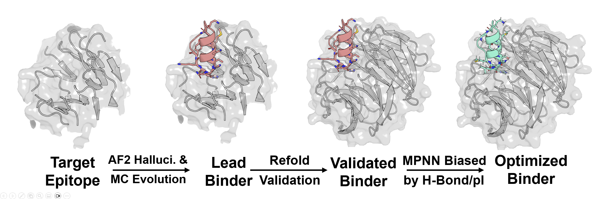

# EpitopeCraft

[BindCraft](https://github.com/martinpacesa/BindCraft) variant with higher efficiency. Tailored for Huge Targets.

[Preprint URL](https://arxiv.org/abs/2509.25479)

STILL UNDER CONSTRUCTION! Stable version to be released soon.

## Installation
set-up BindCraft virtual env:
`bash install_bindcraft.sh --cuda '12.4' --pkg_manager 'conda'`

Optional:
  set-up [MusiteDeep](https://github.com/duolinwang/MusiteDeep) 
  for post-translational modification metrics.

  set-up virtual env for [esm_if](https://github.com/KULL-Centre/_2024_cagiada_stability/blob/main/stab_ESM_IF.ipynb)
  for extra stability metrics

## Quick start
`python epitopecraft/main.py --target-settings TARGET_SETTING --binder-settings BINER_SETTINGS --advanced-settings ADV_SETTINGS --filter-settings FILTER_SETTING` 

The `epitopecraft/main.py` entry point launches the `HalluDesign` pipeline, which wires
`Hallucinate → Filter → (optional) Graft → Refold → Annotate/Relax → MPNN → final scoring`.
Each step consumes specific parts of the four settings blocks below, so verify these inputs before
launching large jobs.

See `epitopecraft/test/` and `epitopecraft/pipelines/config` for demo settings. 

See `epitopecraft/utils/settings.py` for relevant codes. 

Design results will be saved in `design_path` of  `BinderSettings`. Design metrics is easy to analyse with API in `epitopecraft.utils.design_record`.

### TargetSettings (`epitopecraft/utils/settings.py:39`)
- `starting_pdb`: trimmed target that Hallucinate and Refold load.
- `chains`: comma-separated chains exposed to the binder; other chains are dropped up front.
- `target_hotspot_residues`: optional residue ranges that keep Hallucinate focused on a patch.
- `full_target_pdb`/`full_target_chain`: intact target used when the templated `Graft` step runs.
- `full_binder_chain` & auto-derived `new_binder_chain`: ensure binder chain IDs never clash with
  target chains so that Graft/MPNN receive the correct binder/target chain mapping.

### BinderSettings (`epitopecraft/utils/settings.py:63`)
- `design_path`: root folder where `BasePipeline` saves Hallucinate, Refold, Relax, and MPNN logs.
- `binder_name`: prefix used by every step when naming batch folders, CSV summaries, and PDBs.
- `binder_lengths`: lengths sampled by Hallucinate/MPNN when generating binder backbones.
- `random_seeds`: per-trajectory seeds; diversify to explore more hallucination trajectories.
- `helix_values` (optional): overrides helix bias before Hallucinate/MPNN run.
- `global_seed`: fallback RNG seed for any stage lacking an explicit seed.

### AdvancedSettings
See `epitopecraft/pipelines/config/base_advanced_settings.yaml` for keys and helps in the demo quick start.

### FilterSettings
- `filters_path`: JSON bundle describing `thresholds` and `recipes` consumed by the `Filter` step.
- Inline `thresholds`/`recipes`: merged on top of the file to let you tweak values quickly.
- Recipes named `after:hallucinate` and `after:refold` are referenced directly in HalluDesign, so
  ensure they exist (or update the pipeline if you rename them). Each recipe should contain the
  flattened thresholds needed at that checkpoint (see `FilterSettings.recipe_threshold`).

Note: prefix of key values is configurable in `AdvancedSettings`. Make sure the key in `FilterSettings` exists in `Pipeline.metrics_to_add` 

## Build your own design pipeline with `Step`s
See `epitopecraft/steps/` for independent design/score steps.
Steps are initialized by `GlobalSettings` and called by `Step.process_record` and `Step.process_batch` methods. 
Call `Step.{pdb,params}_to_take` to see input keys.
Call `Step.{metrics,pdb,track}_to_add` to see outputs keys.

## Acknowledgement 
TBD
